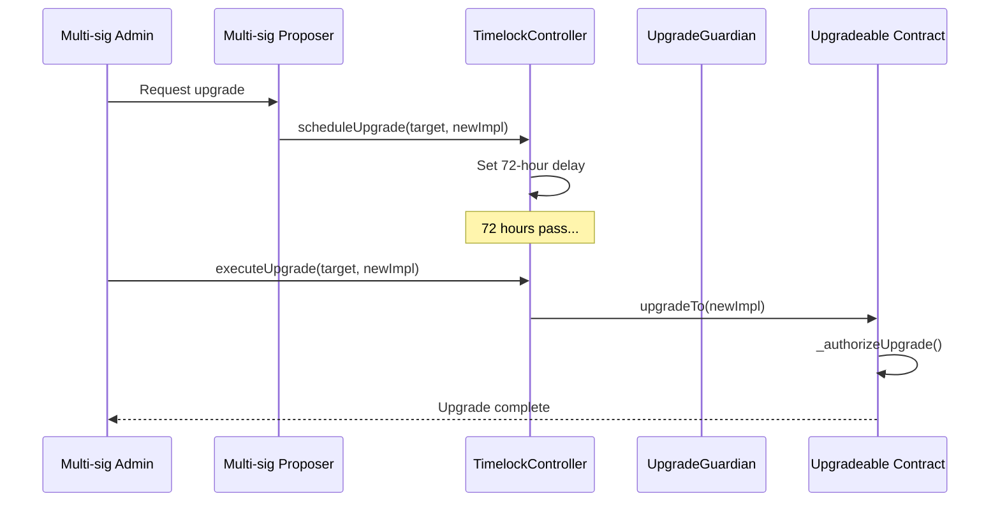
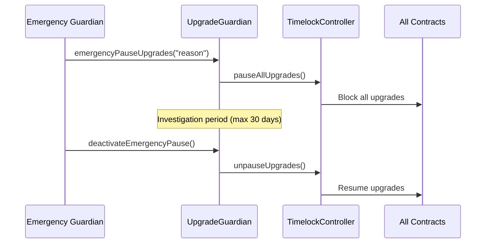

# Piron Pools - Enterprise Upgradeable Architecture

## 🏗️ **OVERVIEW: FULLY UPGRADEABLE SYSTEM**

Piron Pools now implements a **complete upgradeable architecture** where every contract (except AccessManager for security) can be upgraded through a secure timelock mechanism with multi-signature controls.

## 📋 **ARCHITECTURE SUMMARY**

```
┌─────────────────────────────────────────────────────────────────┐
│                    GOVERNANCE LAYER                             │
├─────────────────────────────────────────────────────────────────┤
│  TimelockController (72h delay) ←→ UpgradeGuardian (Emergency)  │
│           ↓                                ↓                    │
│    Multi-sig Proposers              Emergency Contacts          │
│    Multi-sig Executors              (Can pause upgrades)        │
│    Multi-sig Cancellers                                         │
└─────────────────────────────────────────────────────────────────┘
                               │
                               ▼
┌─────────────────────────────────────────────────────────────────┐
│                   CORE UPGRADEABLE CONTRACTS                    │
├─────────────────────────────────────────────────────────────────┤
│  Manager (UUPS Proxy) ←→ PoolRegistry (UUPS Proxy)             │
│       │                        │                               │
│       ▼                        ▼                               │
│  PoolFactory (UUPS Proxy) ──→ Creates Upgradeable Pools        │
│                                                                 │
│  For each pool:                                                 │
│  • LiquidityPool (UUPS Proxy)                                  │
│  • PoolEscrow (UUPS Proxy)                                     │
└─────────────────────────────────────────────────────────────────┘
                               │
                               ▼
┌─────────────────────────────────────────────────────────────────┐
│                    IMMUTABLE CONTRACTS                          │
├─────────────────────────────────────────────────────────────────┤
│  AccessManager (Security-critical - NEVER upgrade)             │
│  CalculationLibrary (Pure functions - no state)                │
│  IPoolTypes (Interface - no logic)                             │
└─────────────────────────────────────────────────────────────────┘
```

## 🔧 **UPGRADEABLE CONTRACTS BREAKDOWN**

### **1. Manager Contract (Core Business Logic)**

**Proxy Type**: UUPS (Universal Upgradeable Proxy Standard)
**Upgrade Authority**: TimelockController (72-hour delay)

```solidity
contract Manager is Initializable, UUPSUpgradeable, IPoolManager, ReentrancyGuardUpgradeable {
    // State variables preserved across upgrades
    mapping(address => IPoolTypes.PoolData) public pools;
    mapping(address => mapping(address => IPoolTypes.UserPoolData)) public poolUsers;
    
    // Upgrade controls
    address public timelockController;
    uint256 public version;
    
    function _authorizeUpgrade(address newImplementation) internal override {
        require(msg.sender == timelockController, "Only timelock can upgrade");
        version += 1;
    }
}
```

**Why Upgradeable**: 
- ✅ Add new pool types (managed pools, tranched pools)
- ✅ Enhance calculation logic
- ✅ Add new enterprise features (analytics, reporting)
- ✅ Fix bugs in business logic

### **2. PoolFactory Contract (Pool Creation)**

**Proxy Type**: UUPS
**Upgrade Authority**: TimelockController

```solidity
contract PoolFactory is Initializable, UUPSUpgradeable, IPoolFactory, ReentrancyGuardUpgradeable {
    // Implementation contracts for new pools
    address public liquidityPoolImplementation;
    address public poolEscrowImplementation;
    
    function createPool() external returns (address pool, address escrow) {
        // Creates UPGRADEABLE proxies for each new pool
        escrow = address(new ERC1967Proxy(poolEscrowImplementation, escrowInitData));
        pool = address(new ERC1967Proxy(liquidityPoolImplementation, poolInitData));
    }
}
```

**Why Upgradeable**:
- ✅ Support new pool types (Stable Yield, Locked Yield, Index Pools)
- ✅ Update pool creation logic
- ✅ Enhance pool symbol generation
- ✅ Add validation rules

### **3. PoolRegistry Contract (Pool Tracking)**

**Proxy Type**: UUPS
**Upgrade Authority**: TimelockController

```solidity
contract PoolRegistry is Initializable, UUPSUpgradeable, IPoolRegistry {
    mapping(address => PoolInfo) private poolInfos;
    mapping(address => bool) private approvedAssets;
    
    // Future: Add managed pool tracking
    // mapping(address => ManagedPoolInfo) private managedPoolInfos;
}
```

**Why Upgradeable**:
- ✅ Add managed pool support
- ✅ Enhanced pool categorization
- ✅ Analytics and reporting features
- ✅ Multi-region pool tracking

### **4. LiquidityPool Contract (Individual Pool Logic)**

**Proxy Type**: UUPS (Each pool is a separate proxy)
**Upgrade Authority**: TimelockController

```solidity
contract LiquidityPool is Initializable, UUPSUpgradeable, ERC4626Upgradeable, ILiquidityPool, PausableUpgradeable {
    address public manager; // Direct Manager reference
    address public escrow;
    uint256 public version;
    
    function _authorizeUpgrade(address newImplementation) internal override {
        require(msg.sender == timelockController, "Only timelock can upgrade");
    }
    
    function updateManager(address newManager) external {
        require(msg.sender == timelockController, "Only timelock");
        manager = newManager;
    }
}
```

**Why Upgradeable**:
- ✅ Fix ERC4626 compliance issues
- ✅ Add new withdrawal mechanisms
- ✅ Enhance user experience features
- ✅ Add analytics tracking

### **5. PoolEscrow Contract (Fund Custody)**

**Proxy Type**: UUPS (Each escrow is a separate proxy)
**Upgrade Authority**: TimelockController

```solidity
contract PoolEscrow is Initializable, UUPSUpgradeable, IPoolEscrow, ReentrancyGuardUpgradeable, AccessControlUpgradeable {
    IERC20Upgradeable public asset;
    address public manager; // Direct Manager reference
    address public spvAddress;
    uint256 public version;
    
    function updateManager(address newManager) external {
        require(msg.sender == timelockController, "Only timelock");
        manager = newManager;
    }
}
```

**Why Upgradeable**:
- ✅ Enhanced security features
- ✅ Multi-signature fund management
- ✅ Advanced transfer tracking
- ✅ Compliance reporting

## 🔄 **UPGRADE INTERACTION FLOW**

### **Standard Upgrade Process (72-hour delay)**



### **Emergency Pause Flow**



## ✅ **SIMPLIFIED ARCHITECTURE: NO MANAGER REGISTRY**

### **✅ SOLUTION: Direct Manager References**

Since everything is upgradeable, we use **direct references** instead of a registry pattern:

```solidity
// SIMPLIFIED: Direct Manager reference
contract LiquidityPool is Initializable, UUPSUpgradeable, ERC4626Upgradeable {
    address public manager; // Direct reference
    
    function initialize(
        IERC20Upgradeable asset_,
        string memory name_,
        string memory symbol_,
        address _manager,
        address _escrow,
        address _timelockController
    ) public initializer {
        manager = _manager; // Direct assignment
    }
    
    // Update manager if needed (rare)
    function updateManager(address newManager) external {
        require(msg.sender == timelockController, "Only timelock");
        manager = newManager;
    }
}
```

### **✅ Benefits of Direct References**:

1. **🎯 Simpler Architecture**: One upgrade path per contract
2. **💰 Lower Gas Costs**: No registry lookups  
3. **🔒 Better Security**: Fewer contracts in upgrade chain
4. **🛠️ Easier Maintenance**: Direct relationships
5. **📊 Clearer Auditing**: Explicit upgrade paths
6. **⚡ Better Performance**: No indirection overhead

## 🎯 **FINAL RECOMMENDED ARCHITECTURE**

```
GOVERNANCE (Immutable Security Layer)
├── TimelockController (72h delay + multi-sig)
├── UpgradeGuardian (Emergency pause)
└── AccessManager (Role management - NEVER upgrade)

CORE BUSINESS LOGIC (All Upgradeable via UUPS)
├── Manager Proxy ←→ Manager Implementation
├── PoolRegistry Proxy ←→ PoolRegistry Implementation  
├── PoolFactory Proxy ←→ PoolFactory Implementation
│
├── For each pool:
│   ├── LiquidityPool Proxy ←→ LiquidityPool Implementation
│   └── PoolEscrow Proxy ←→ PoolEscrow Implementation
│
└── PURE LIBRARIES (Immutable)
    ├── CalculationLibrary
    └── IPoolTypes
```

## 🚀 **ENTERPRISE BENEFITS**

### **✅ Maximum Flexibility**
- **Any contract** can be upgraded independently
- **New features** can be added without redeployment
- **Bug fixes** can be applied surgically

### **🛡️ Enterprise Security**
- **72-hour upgrade delay** prevents rushed changes
- **Multi-signature controls** (4/7 proposers, 4/7 executors)
- **Emergency guardian** can pause all upgrades
- **Version tracking** for audit trails

### **💰 Cost Efficiency**
- **Gas optimization** through upgrades
- **Feature additions** without full redeployment
- **Bug fixes** without losing state

### **🔍 Operational Excellence**
- **Granular upgrade control** per contract type
- **Rollback capability** to previous versions
- **Emergency pause** for security incidents
- **Comprehensive logging** for compliance

## 🎯 **NEXT STEPS**

1. **✅ Remove ManagerRegistry** (unnecessary complexity)
2. **✅ Simplify direct Manager references**
3. **✅ Test upgrade scenarios**
4. **✅ Document upgrade procedures**
5. **✅ Prepare for testnet deployment**

This architecture gives Piron **maximum enterprise flexibility** while maintaining **bank-grade security** through proper governance controls.